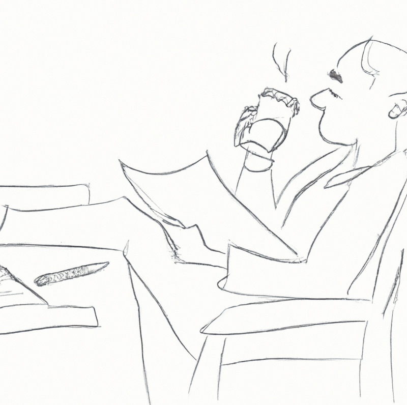

# The TA Automator (aka `tautomator`)

Teaching Assistants (TAs) and Graders, the unsung heroes of academia, have an important task at hand - grading hundreds of student submissions in a limited time. 
And they only have 20 hours a week at their disposal with only a limited supply of caffeine.
And their just isn't enough caffeine in this world to supply their need.

But worry not. That's where `tautomator` comes in - your friendly neighborhood automator to the rescue! ☕️

But why such a hilarious name for such an important project?
Because let's face it, grading can sometimes feel like dealing with tautologies. 
While some submissions are spot-on, many others are tautologically equivalent to our rubrics. 
We're looking for those that break the mold, those that make us stop and think where the student went wrong.
Enter `tautomator` - the superhero who automates the mundane, time-consuming, and often tautological parts of grading, giving TAs and Graders more time to think deeply and slowly. Tautamator is here to smooth out your grading process, making it more efficient, effective, and caffeine-efficient.

So sit back, relax, and let tautomator do the heavy lifting - because even superheroes need a break sometimes.
With tautomator on your side, you can grade more efficiently, effectively, and with a clear conscience knowing that you're doing your part to conserve the planet's caffeine resources. 🌍️

## But what is Tautamator, technically?

At its core, it's a collection of patterns of tedious and repitive tasks that keep recurring throughout different university (and otherwise online) courses taught using different learning management systems (LMSs) and MOOC tools, e.g. Canvas, Piazza, Gradescope, etc.

At a concrete level, it's a collection of scripts that automate several of the already identified patterns of tedious and repetitive tasks, e.g. downloading student submissions, dynamically changing rubrics, checking for plagiarism, etc.

